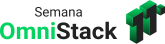

<h3 align="center">
    
</h3>

<h1 align="center"></h1>

<h3 align="center">
  Semana Omnistack 11.0 | Be The Hero
</h3>

  

  

  

  <a href="#rocket-sobre">Sobre</a>&nbsp;&nbsp;&nbsp;|&nbsp;&nbsp;&nbsp;
  <a href="#wrench-stack-e-tools">Stack utilizada</a>&nbsp;&nbsp;&nbsp;|&nbsp;&nbsp;&nbsp;
  <a href="#memo-licença">Licença</a>

## :rocket: Sobre

Bem-vindos ao **Be The Hero**!

Este projeto foi desenvolvido ao longo da **Semana OmniStack 11.0**, junto com o pessoal da [Rocketsheat](https://github.com/Rocketseat).

O objetivo do projeto é permitir a busca por Ongs e suas necessidades, facilitando o contato para suprir os Casos/Incidentes divulgados. Para isso, o projeto está dividido em 3 partes:

- Back-end (REST API em Node.js)
- Front-end (Interface Web em React)
- Mobile (App em React Native + Expo)

### Aplicação online

(Em construção.)

## :wrench: Stack e Tools

### Back-end

- [Node.js](https://nodejs.org/en/)
- [Express.js](https://expressjs.com/)
- [Nodemon](https://nodemon.io/)
- [Knex.js](http://knexjs.org/)
- [Crypto](https://nodejs.org/api/crypto.html)

### Front-end

(Em construção.)

### Mobile

(Em construção.)

## :memo: Licença

Esse projeto está sob a licença MIT.

---

Feito com ♥ by [leandrovi](https://github.com/leandrovi)
